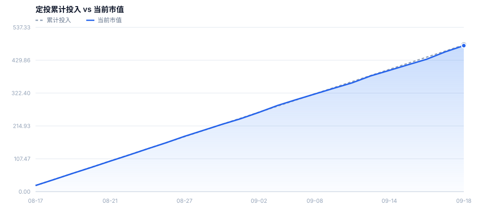

# 标普500指数基金每日定投

> 自动跟踪标普500指数基金（QDII）每日定投。数据取自天天基金披露的官方净值与申购状态，由 GitHub Actions 自动更新。

**仓库**：https://github.com/SayangChun/sp500-dca
**在线看板**：https://sayangchun.github.io/sp500-dca/

## 当前状态

- **开始定投**：2026-08-17（持续定投，无终止日期）
- **最新净值日**：2026-09-18
- **实际定投交易日**：24 天
- **因暂停申购跳过**：1 天
- **累计投入**：¥469.77
- **当前市值**：¥467.48
- **累计盈亏**：¥-2.29（-0.49%）

## 持仓明细

| 基金 | 代码 | 每日定投 | 定投交易日 | 投入本金 | 持有份额 | 成本净值 | 最新净值 | 当前市值 | 累计盈亏 | 收益率 |
|:---|:---:|:---:|:---:|---:|---:|---:|---:|---:|---:|---:|
| 摩根标普500 A | 017641 | ¥9.99 | 23 | ¥229.77 | 134.92 | 1.7030 | 1.6939 | ¥228.54 | ¥-1.23 | -0.53% |
| 摩根标普500 C | 019305 | ¥10.00 | 24 | ¥240.00 | 142.31 | 1.6865 | 1.6790 | ¥238.94 | ¥-1.06 | -0.44% |
| **合计** | — | ¥19.99 | 24 | **¥469.77** | **277.23** | — | — | **¥467.48** | **¥-2.29** | **-0.49%** |

## 定投曲线

## 最近记录

| 申购日 (T) | 份额确认日 (T+2) | 单位净值 | 累计投入 | 当前市值 | 累计盈亏 |
|:---|:---:|---:|---:|---:|---:|
| 2026-09-18 | 待确认 | 0.0000 | ¥469.77 | ¥467.48 | ¥-2.29 |
| 2026-09-17 | 2026-09-21 | 1.6939 | ¥459.77 | ¥457.30 | ¥-2.47 |
| 2026-09-16 | 2026-09-18 | 1.6770 | ¥439.78 | ¥432.94 | ¥-6.84 |
| 2026-09-15 | 2026-09-17 | 1.6848 | ¥419.79 | ¥414.87 | ¥-4.92 |
| 2026-09-14 | 2026-09-16 | 1.6925 | ¥399.80 | ¥396.68 | ¥-3.12 |
| 2026-09-11 | 2026-09-15 | 1.7012 | ¥379.81 | ¥378.64 | ¥-1.17 |
| 2026-09-10 | 2026-09-14 | 1.6882 | ¥359.82 | ¥355.91 | ¥-3.91 |
| 2026-09-09 | 2026-09-11 | 1.6975 | ¥339.83 | ¥337.77 | ¥-2.06 |
| 2026-09-08 | 2026-09-10 | 1.7060 | ¥319.84 | ¥319.37 | ¥-0.47 |
| 2026-09-04 | 2026-09-08 | 1.7151 | ¥299.85 | ¥300.96 | ¥+1.11 |

## 非投资日说明

以下交易日因基金**暂停申购**，当日定投未执行：

| 日期 | 当日申购状态 | 涉及基金 | 当日单位净值 |
|:---|:---|:---|---:|
| 2026-09-07 | 暂停申购 | 摩根标普500 A、摩根标普500 C | 摩根标普500 A 1.7152 / 摩根标普500 C 1.6989 |

## 定投规则（按境内基金实际开放申购口径）

1. **投资日**：仅在该基金为交易日的当天执行；非交易日不申购。
2. **申购状态**：仅当该交易日「开放申购」时执行；公告「暂停申购」的交易日一律不执行。
3. **申购时段**：交易日 9:30–15:00；15:00 前提交的申请视为当日（T 日）。
4. **确认规则**：QDII 基金按 **T 日单位净值**确认份额，**T+2 个交易日**确认。
5. **份额计算**：净申购金额 = 定投金额 ÷ (1 + 申购费率)；份额 = 净申购金额 ÷ T 日单位净值，四舍五入保留 **2 位小数**。

- 摩根标普500指数(QDII)人民币A（017641）：每个可申购交易日 ¥9.99，免申购费，单日累计购买上限 ¥10
- 摩根标普500指数(QDII)人民币C（019305）：每个可申购交易日 ¥10.00，免申购费，单日累计购买上限 ¥10
- 起投日：2026-08-17，无终止日期。

## 净值披露节奏

- 基金净值通常为 **T+1 晚间**披露：净值日 D 的数据一般在 D+1 的 20:00~23:00（北京时间）才出现。
- 周末与节假日不产生净值，因此本仓库可能连续 2~3 天没有新提交，属正常现象。

## 数据与自动化

- 净值数据源：天天基金（东方财富）历史净值 + 申购状态（https://fund.eastmoney.com/）
  - 017641 申购状态：天天基金历史净值列表接口
  - 019305 申购状态：天天基金历史净值列表接口
- 更新方式：GitHub Actions **每小时**轮询，自动抓取净值与申购状态、重算持仓并提交结果；数据无变化时不产生提交。
- 看板页面：`reports/index.html`（在线看板见上方链接）。

---
最后更新：2026-09-21 21:36 (UTC+8)

*本仓库仅用于个人投资记录，不构成任何投资建议。*
